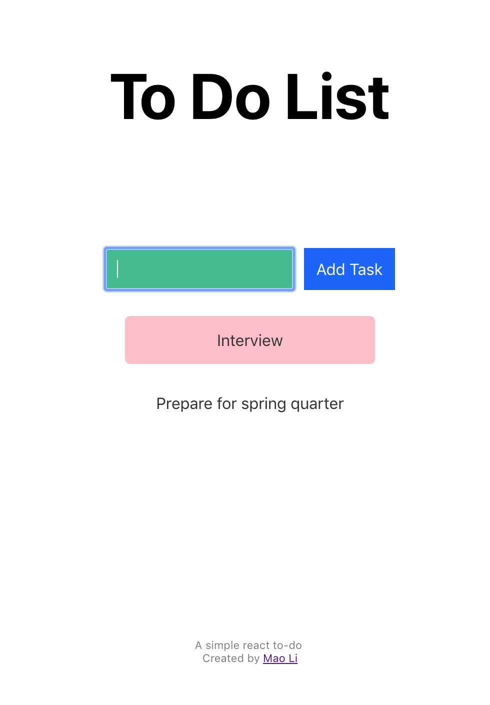

# To-Do List React

This project is a web based todo list. User can add with text box and delete todo item by clicking.
It is deployed as a [static website with Azure](https://react-todo.azurewebsites.net). 

It serves as a simple hand-on project for me to play with web development (React, Azure, etc). I actively extending
this project to include more features (login/logout, better UI, etc.).
It's also an examplary project which will be included in my tutorial about React and Azure.

 

 

### Reference
It originates from react-todo tutorials by 
* [Xiqiang Lin](https://github.com/xiqianglin/react-todo). Thanks Xiqiang for mentoring me on web dev and suggest a todo application.
* ["Create a Simple To Do List"](https://hackernoon.com/create-a-simple-todo-app-in-react-9bd29054566b). Thanks this tutorial for providing  a clear skeleton of the project and detailed instructions. Adjustments have been made from the original tutorial to achieve this current project.

This project was bootstrapped with [Create React App](https://github.com/facebook/create-react-app).

